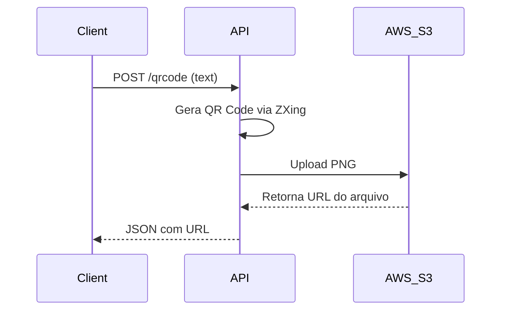

# QR Code Generator

**Tecnologias:**  


Uma aplicação Spring Boot que gera QR Codes e os armazena no AWS S3.  
Este projeto demonstra a integração da biblioteca [ZXing](https://github.com/zxing/zxing) para geração de QR Codes e o uso do **AWS S3** para armazenamento.


## 🚀 How to Use
Este guia mostra como configurar e executar a aplicação **QR Code Generator**.

---

## ⚙️ Prerequisites
- [Java 21 JDK](https://adoptium.net/)  
- [Maven](https://maven.apache.org/)  
- [Docker](https://www.docker.com/)  
- [AWS Account](https://aws.amazon.com/) com acesso ao **S3**  
- [AWS CLI](https://aws.amazon.com/cli/) configurado com credenciais válidas  

---

## 🔑 Environment Variables
Crie um arquivo `.env` na raiz do projeto com as seguintes variáveis:

```env
AWS_ACCESS_KEY_ID=your_access_key
AWS_SECRET_ACCESS_KEY=your_secret_key
AWS_REGION=your_region
AWS_BUCKET_NAME=your_bucket_name
````

---

## ▶️ Running the Application

### Local Development

1. Crie o arquivo `.env` como descrito acima
2. Compile o projeto:

   ```bash
   mvn clean package
   ```
3. Execute a aplicação:

   ```bash
   mvn spring-boot:run
   ```

### Docker Deployment

1. Construa a imagem Docker:

   ```bash
   docker build -t qrcode-generator:X.X .
   ```

   *(lembre-se de substituir `X.X` pela versão desejada)*

2. Rode o container:

   ```bash
   docker run --env-file .env -p 8080:8080 qrcode-generator:X.X
   ```

   *(substitua o caminho do `.env` se necessário)*

---

## ☁️ AWS S3 Configuration

1. Crie um bucket no **S3**
2. Atualize a variável `AWS_BUCKET_NAME` no `.env`
3. Garanta que suas credenciais AWS tenham permissão para acessar o bucket

---

## 🔄 Application Flow

> **Obs:** Este diagrama pode ser editado no [Mermaid Live Editor](https://mermaid-js.github.io/mermaid-live-editor).



---

## 📡 API Endpoints

### `POST /qrcode`

Gera um QR Code a partir do texto informado e o armazena no **AWS S3**.
O QR Code será criado em formato **PNG** com dimensões de **200x200**.


#### Parameters

| Name | Required | Type   | Description                       |
| ---- | -------- | ------ | --------------------------------- |
| text | ✅ yes    | string | Texto a ser convertido em QR Code |


#### Success Response

```json
{
  "url": "https://your-bucket.s3.your-region.amazonaws.com/random-uuid"
}
```

#### Error Response

```json
{
  "error": "Internal Server Error"
}
```

Retorna **500** caso ocorra falha na geração ou upload no S3.

#### Example Usage

```bash
curl -X POST http://localhost:8080/qrcode \
     -H "Content-Type: application/json" \
     -d '{"text": "https://example.com"}'
```


